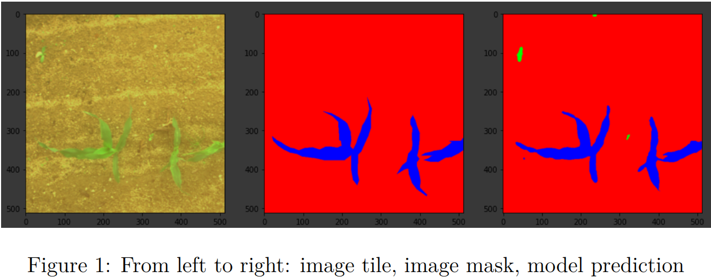

# plant_image_segmentation
segment images of plants into desired plant / weeds / background

part of the ACRE competition

## Repository content
* Model notebook
* Work report

## Problem description
### Input
* 4 sets of images which differ in perspective / resolution / format etc, each set is divided into 2 subsets (images of Mais corn / images of Haricot beans)
* A mask for each image of the training dataset

### Output
Segmentation masks for test set images

## Solution approach
Our solution is based on the UNET model, we also used transfer learning from VGG16 for the encoder. Images were cut into 512x512 tiles. In the final result we achieved performance of 0.72 intersection over union score on the test datasets.

Example performance:

## Contributors
[Eugenio Ostrovan](https://github.com/lleugen) and [Dennis Motta](https://github.com/Desno365)

with help from course materials by professors Francesco Lattari, Matteo Matteucci and Giacomo Boracchi
